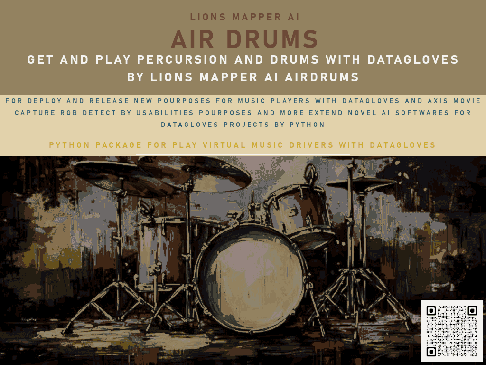

# LionsMapperAI-AirDrums
AI-powered Virtual Percussion with DataGloves

---




**Developer:** `#asytrick`
📧 **Contact:** [eusmool@gmail.com](mailto:eusmool@gmail.com)

---

## 🚀 Installation

```bash
pip install lionsmapper-airdrums==8.0
```

---

## 🥁 Quick Start Example

```python
from lionsmapper_airdrums import *

# Configure DataGloves with RGB color calibration
set_dataglove(side='LEFT', rgb='255,255,255')
set_dataglove(side='RIGHT', rgb='0,0,0')

# Configure FootGloves with RGB color calibration
set_foot_glove(side='LEFT', rgb='110,110,110')
set_foot_glove(side='RIGHT', rgb='80,80,80')

# Define the audio set (WAV files)
drums_set_wav = {
    "hihats": "hihats.wav",
    "crash_cymbal": "crash_cymbal.wav",
    "ride_cymbal": "ride_cymbal.wav",
    "snare_drum": "snare_drum.wav",
    "high_tom": "high_tom.wav",
    "mid_tom": "mid_tom.wav",
    "floor_tom": "floor_tom.wav",
    "bass_drum": "bass_drum.wav"
}

# Define calibration coordinates for drum detection
drums_set = {
    "hihats": {"x": 0, "y": 0},
    "crash_cymbal": {"x": 0, "y": 0},
    "ride_cymbal": {"x": 0, "y": 0},
    "snare_drum": {"x": 0, "y": 0},
    "high_tom": {"x": 0, "y": 0},
    "mid_tom": {"x": 0, "y": 0},
    "floor_tom": {"x": 0, "y": 0},
    "bass_drum": {"x": 0, "y": 0}
}

# Start AirDrums session
play_drums(index=1, lenght_time=5)
```

---

## 📖 About LionsMapperAI

**LionsMapperAI AirDrums** is a **prototype** designed for **DSP (Digital Signal Processing)** research and experimentation.
It uses **functional calibration points** and **classic function points methodology** to simulate and extend percussion models for musicians, developers, and AI researchers.

This project is only a **sketch** of a larger AI percussion system and is intended to demonstrate the integration of **gesture detection**, **color-based mapping**, and **audio synthesis** into a coherent workflow.

For extended documentation and usage guidelines, please check the manual here:
👉 [./manual/README.MD](./manual/README.MD)

---

## 🌍 Why GitHub?

We **thank GitHub.com** for being an incredible platform that **empowers developers and investors worldwide**.
GitHub makes it possible to reduce the timeline of a software prototype from **2–10 years down to just 2 hours or 2 days**, accelerating innovation at an unprecedented scale.

---

## 📌 Project Status

* Version: `8.0`
* Stage: **Prototype / Research**
* Focus: **DSP, AI-assisted percussion, functional extensions**

